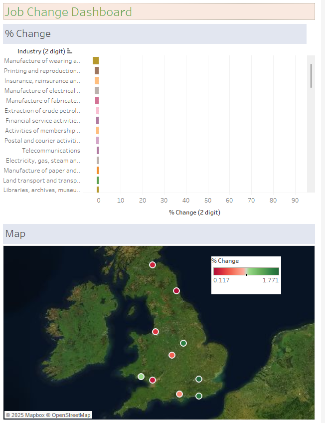

# Data visualisation in Tableau- Job Change

**Please download the EMSI_JobChange_UK dataset [here.](https://justit831-my.sharepoint.com/:x:/g/personal/danpe_justit_co_uk/EV6gwoO1S4tMtXmhuzIr7i0Bx3nEukrbXJoQb6txQvFO4A?e=LhdeAt)**

This dataset contains employment data by industry for the years 2011 and 2014, broken down by city across Great Britain.

1.	**Upload Data:** Begin by uploading the dataset via the connect pane, selecting Excel as the file format for upload.

2.	**Create a Bar Chart for % Change:** Generate a bar chart to visualise the percentage change in employment across different industries between 2011 and 2014. This will help highlight areas with significant job growth or decline.

3.	**Sort the Rows:** After creating the bar chart, sort the rows to organise the data logically, making it easier to interpret the percentage changes.

4.	**Remove Null Values:** Ensure that any null or missing values in the dataset are removed to maintain data integrity and accuracy in the analysis.

5.	**Create a Map:** Generate a map to visually display the key city locations affected by the changes in employment. This map will provide a geographic overview of the areas with the most significant shifts in employment across industries.

6.	**Remove Redundant Legend:** On the map, the legend displaying sub-industry names may be redundant, as the bar chart already provides this information. Therefore, we can remove the legend to declutter the map.

7.	**Create a Dashboard:** Finally, compile a dashboard that displays both the bar chart showing the percentage change in employment and the map highlighting the key city locations impacted by these changes. This combined view will provide a comprehensive understanding of the data and its geographical context.

By following these steps, I have created a clear and informative visualisation of the employment changes across different industries in Great Britain.

**Data Source: Just IT**

**Full Project work book [here.](https://drive.google.com/file/d/1qIg4G0To6PRDWCfSek-BKEv2ALWiMf0z/view?usp=drive_link)**

**Click [here](https://github.com/Alamin-analyser/Data-visualisation-in-Tableau-Health-Survey) to see another Tableau Project.**
